# Quizzard 🧙‍♂️

<p align="center">
  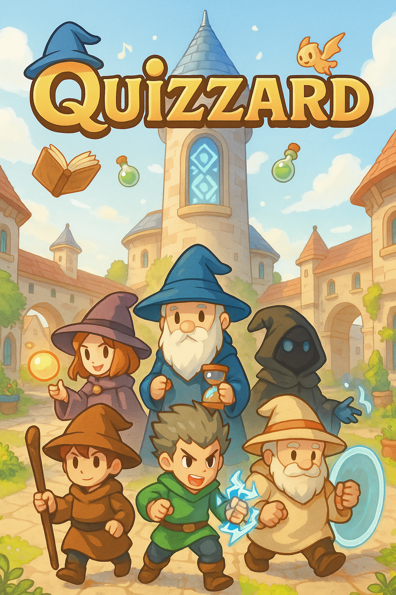
</p>

Quizzard is an invention prototype developed for the subject Science, Technology, and Society. The project explores making studying more engaging by blending it with the mechanics of a classic turn-based RPG. It's a game where players battle monsters not with swords, but with knowledge.

The core of the game is built around customizable decks of questions and answers. Users can load a deck on any topic they wish to review, and the game will pull questions from it for battles. While this is a prototype and not the final version, the main gameplay loop is fully functional and serves as an effective study tool.

---

## Core Features 🎮

The gameplay is a straightforward loop: a question from the chosen deck appears, and the player must type the answer before the timer runs out. A correct answer results in an attack. An incorrect answer, or running out of time, gives the enemy a turn.

Beyond that basic combat, several RPG systems are built in to create a more complete game experience:

-   **Custom Decks:** The most important feature is the ability to create, edit, and delete study decks. Users can add as many questions and answers as needed, making the platform adaptable for any subject.
-   **Player Progression:** Winning battles grants EXP, allowing the player's character to level up. Leveling up provides skill points that can be spent to improve stats like Intelligence (damage), Focus (time to answer), and more.
-   **Characters with Unique Skills:** A character shop allows players to spend in-game currency (`Quizzite`) to unlock new characters. Each one has a passive skill that changes gameplay, such as a chance to block attacks or steal HP.
-   **Quests and Rewards:** The game assigns random side-quests, like winning a battle without taking damage. Completing these is the primary way to earn `Quizzite` for unlocking characters.
-   **Enemy Abilities:** To keep things interesting, some enemies have unique skills, such as the Stage 2 boss which can heal itself every few turns.

## A Look at the Game 🖼️

Below is a visual tour of the application's main features.
*(Note: Animations in the GIFs may appear less smooth than in the actual application.)*

**Main Menu & Deck Management**
The starting point for the game and the hub for creating and managing study decks.
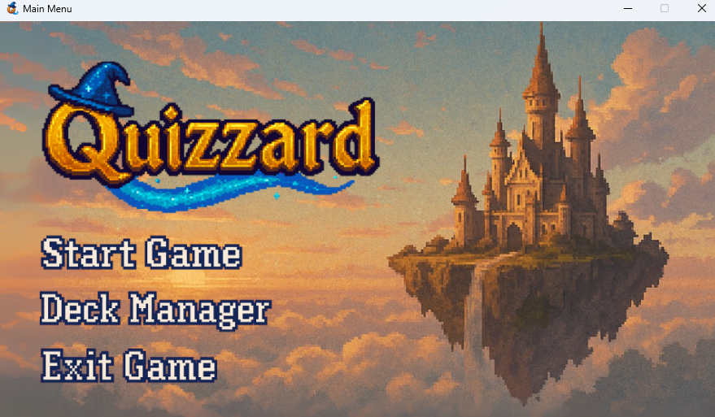
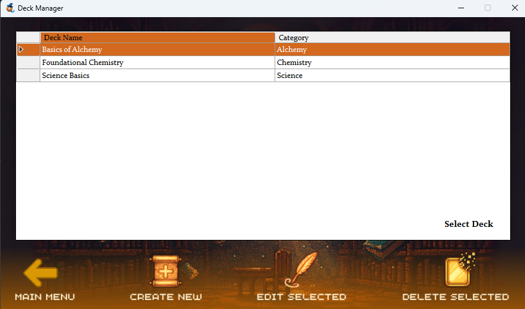
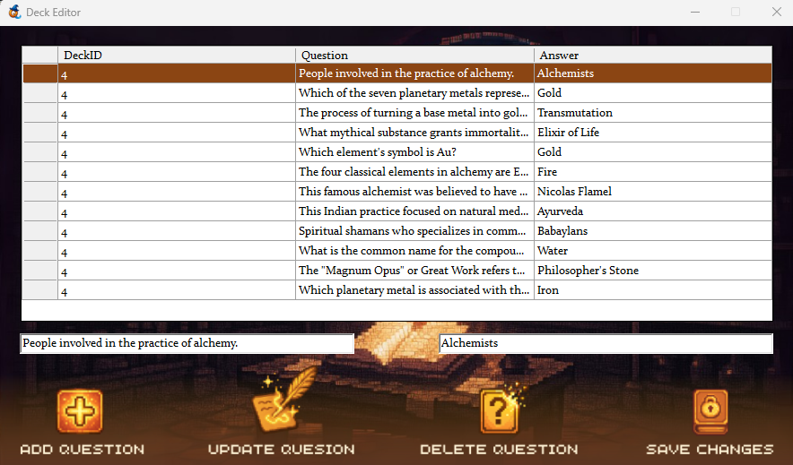

**The Game Lobby & Player Stats**
Players can view their current quest and upgrade character stats before starting a battle.
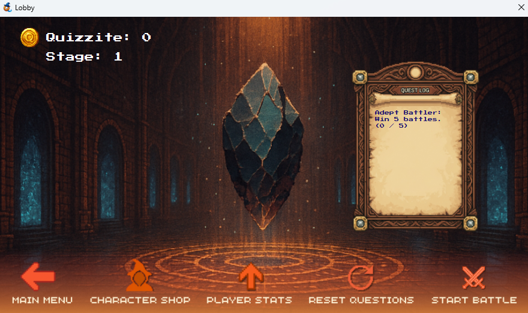
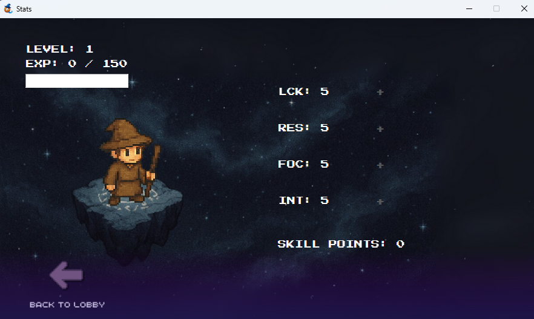

**The Battle Screen**
Answering questions correctly leads to an attack, while wrong answers leave the player vulnerable.
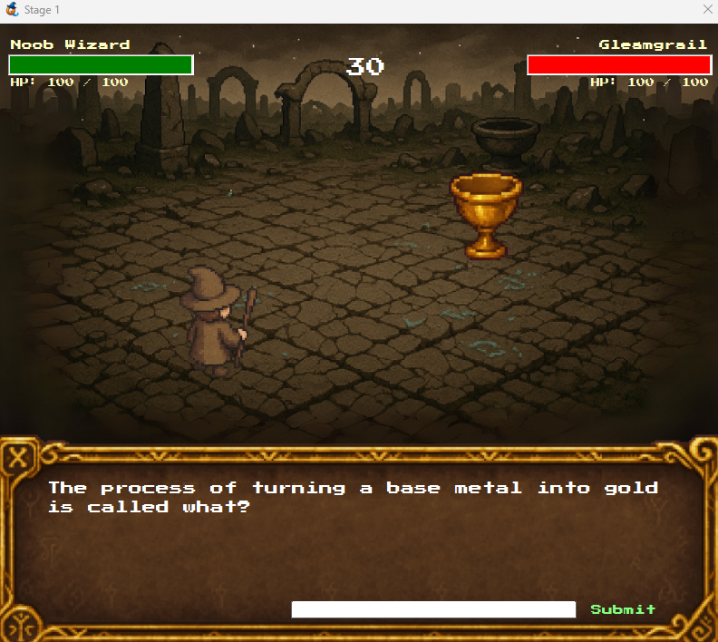

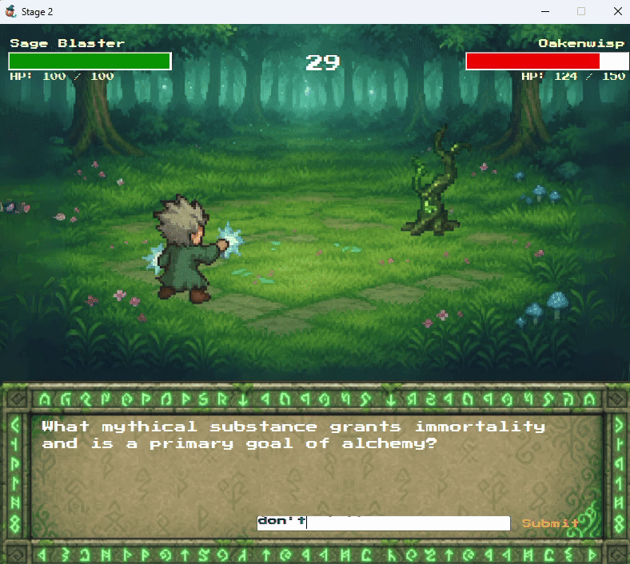
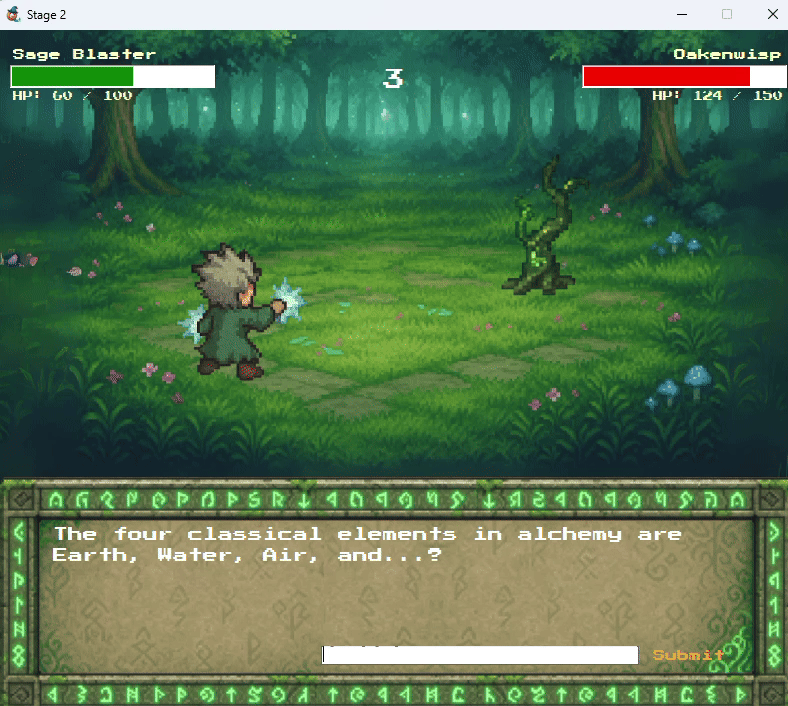
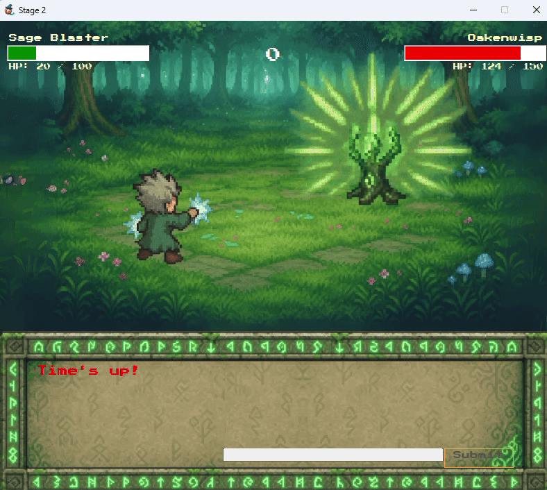

**Character Shop**
New characters with unique skills can be unlocked using `Quizzite` earned from quests and battles.
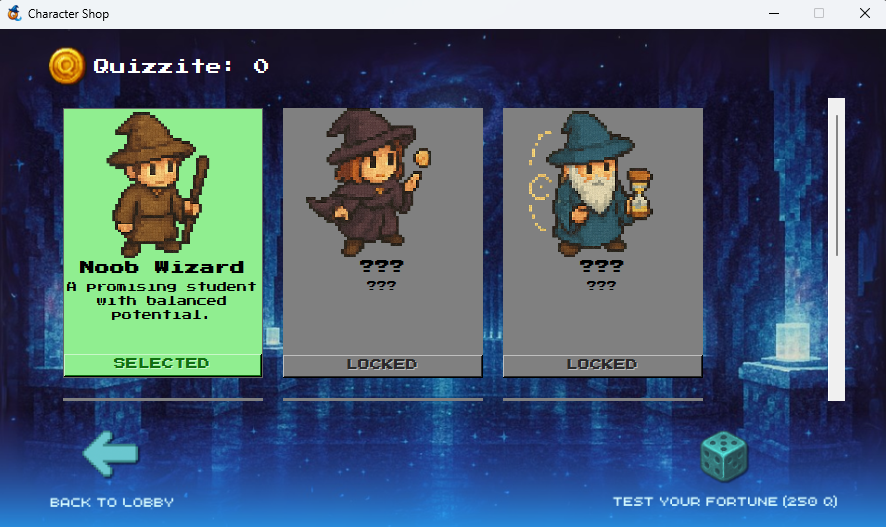

---

## Technology Stack 💻

-   **Language:** VB.NET (Windows Forms)
-   **Database:** Microsoft SQL Server
-   **Assets:** The pixel art for characters and animations was originally created for the project, with assistance from ChatGPT 4o image generation.

---

## Getting Started 🚀

To run this prototype on your local machine, you will need to set up the SQL Server database first. This guide assumes you are using **SQL Server Express**, which is the recommended setup for a smoother experience.

### Prerequisites

-   Visual Studio (2019 or newer)
-   **Microsoft SQL Server Express Edition** (Recommended, and free to download)
-   SQL Server Management Studio (SSMS)

### 1. Database Setup

The application requires a database named `QuizzardDB` to store all game data. A setup script is provided in the repository.

1.  Open **SQL Server Management Studio (SSMS)** and connect to your local **SQL Server Express** instance. The server name is typically `YOUR-PC-NAME\SQLEXPRESS`. **Take note of this server name.**
2.  In the Object Explorer, right-click on the **Databases** folder and select **"New Database..."**.
3.  Name the database **`QuizzardDB`** and click OK.
4.  Open the `QuizzardDB.sql` file from this repository in SSMS (File > Open > File...).
5.  Ensure the dropdown menu at the top of the script window is set to `QuizzardDB`.
6.  Click the **! Execute** button to run the script. This will create all necessary tables and populate them with the game's initial data.

*(Note: Because SQL Server Express typically grants administrative rights to the user who installed it, no further permission steps are usually needed.)*

### 2. Application Setup

1.  Clone this repository to your local machine.
2.  Open the `Quizzard.sln` file in Visual Studio.
3.  Navigate to the **`DatabaseManager.vb`** module.
4.  Locate the `connectionString` variable and update the `Server` value with the name of your SQL Server Express instance from Step 1.

    ```vb.net
    ' In DatabaseManager.vb, find this line:
    Private ReadOnly connectionString As String = "Server=YOUR_SERVER_INSTANCE;Database=QuizzardDB;Integrated Security=True;TrustServerCertificate=True;"
    
    ' And change it to your actual server name, for example:
    Private ReadOnly connectionString As String = "Server=DESKTOP-Z941D28\SQLEXPRESS;Database=QuizzardDB;Integrated Security=True;TrustServerCertificate=True;"
    ```
5.  Build and run the project (F5). It should now connect successfully.

---
### Alternative Setup (Using LocalDB)

If you do not have SQL Server Express installed, you can use the `(localdb)\MSSQLLocalDB` instance that comes with Visual Studio. However, this may require an extra step to grant permissions. If you get a "Login failed" error, you must follow the steps to [add your Windows user as a login in SSMS and map it to the QuizzardDB database with the `db_owner` role](https://docs.microsoft.com/en-us/sql/relational-databases/security/authentication-access/create-a-login?view=sql-server-ver15).

## Prototype Notes 📝

As a prototype, several features planned for a full version are not yet implemented, such as other quiz modes (multiple choice, flashcards). The database structure is functional for the demo but has not been fully optimized or normalized for a larger-scale application.

## Credits 🙏

-   All original pixel art characters, attack effects, and other visual assets were created by the developer.
-   OpenAI's **ChatGPT 4o** was used to assist with generating images for most of the assets.
